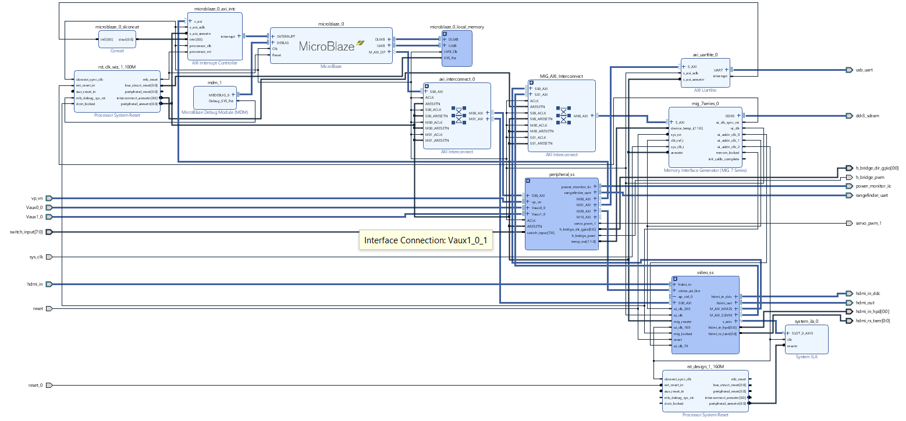

# ece532-self-driving-car
Self driving car using a Nexys Video FPGA Board for ECE532: Digital Systems Design

# How to open the project
In order to open the project, open Vivado 2018.3 and source the tcl script.
The full project archive is also available as a zip file in case the tcl script does not work
Ensure you have cloned https://github.com/Digilent/vivado-library and added it to your repo search path since this project uses ips from Digilent's Vivado ip library.

